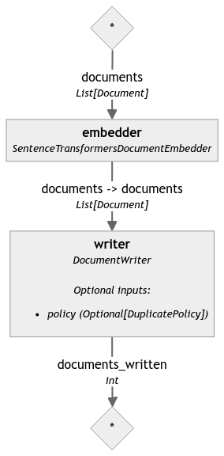

# RAG Pipeline

## Overview

This script provides a pipeline to vectorize and index text documents into a vector database using Haystack 2.0. The primary purpose is to preprocess text files, split them into smaller segments, vectorize them using an embedding model, and then index these vectors into a chosen vector database.

Currently, the pipeline supports Pinecone as the vector database, but it's designed with future scalability in mind, allowing easy integration of other vector databases. The script uses the `SentenceTransformers` model for embedding, and future enhancements will include the ability to select different embedding models based on user preferences.

## Installation

Before running the script, ensure you have installed the necessary dependencies. You can install them using pip:

```bash
pip install -r requirements.txt
```

## Usage

The script is designed to be run from the command line with several arguments to customize the vectorization and indexing process.

### Example Command

```bash
python full_rag_pipeline.py 
--vector_db_type pinecone \
--file_format txt \
--preprocess_split_by word \
--preprocess_split_length 100 \
--embedding_model all-mpnet-base-v2 \
--index_dimension 768 \
--data_path ./data-test/ \
--pinecone_api_key 10f22575-5c62-4509-a497-bbf6ef10373e \
--pinecone_index_name rag-test
```

### Command-Line Arguments

- **General Arguments:**
  - `--data_path`: The path to the directory containing the data files to be indexed. Required.
  - `--file_format`: The format of the data files (e.g., txt). Required.

- **Preprocessing Arguments:**
  - `--preprocess_split_by`: The strategy to split the document (e.g., word). Defaults to "word".
  - `--preprocess_split_length`: The length to split the document. Defaults to 100.

- **Vectorization Arguments:**
  - `--embedding_model`: The embedding model to use for vectorization, such as 'all-MiniLM-L6-v2' for `sentence-transformers`. Required.

- **Indexing Arguments:**
  - `--vector_db_type`: The type of vector database to use (e.g., pinecone). Required.
  - `--index_dimension`: The embedding dimension for the vector database. Defaults to 768.

- **Indexing: Pinecone-Specific Arguments:**
  - `--pinecone_api_key`: The API key for accessing Pinecone.
  - `--pinecone_index_name`: The index name to use in Pinecone.

## Future Enhancements

- **Support for Additional Vector Databases:**
  The script is built to support additional vector databases in the future. When using the script, ensure that you include the vector database-specific arguments that apply to your selected database.

  For example, if you are using a different vector database, you may need to include additional arguments such as the server URL, authentication credentials, or other parameters specific to that database.

- **User-Selected Embedding Models:**
  Currently, the script uses `SentenceTransformers` for document embedding. Future versions will allow users to select different embedding models based on their specific requirements.


## Preprocess Pipeline Visualization


## Vectorization Pipeline Visualization

